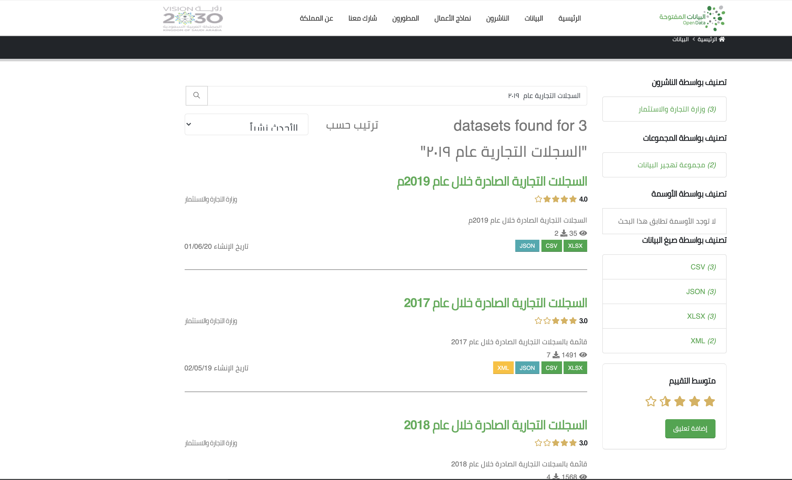
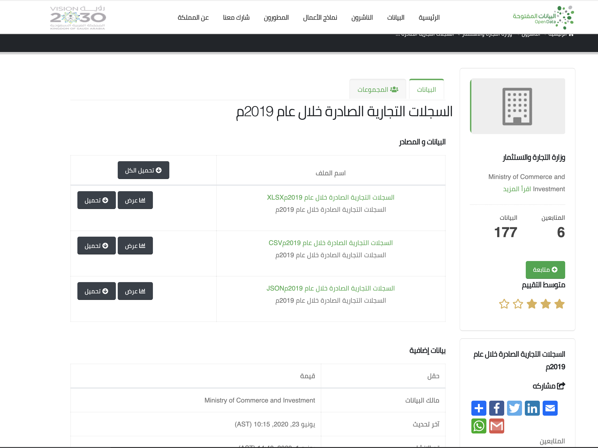
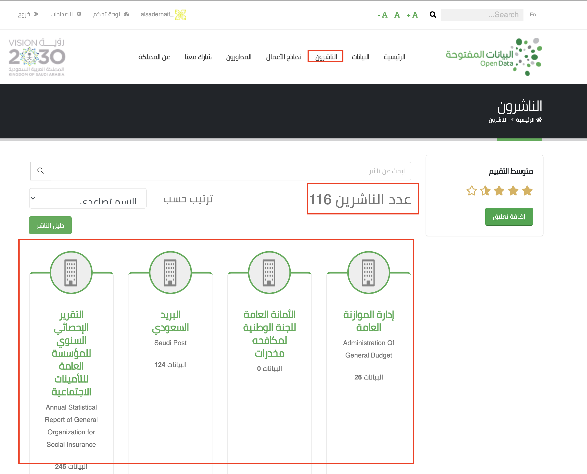
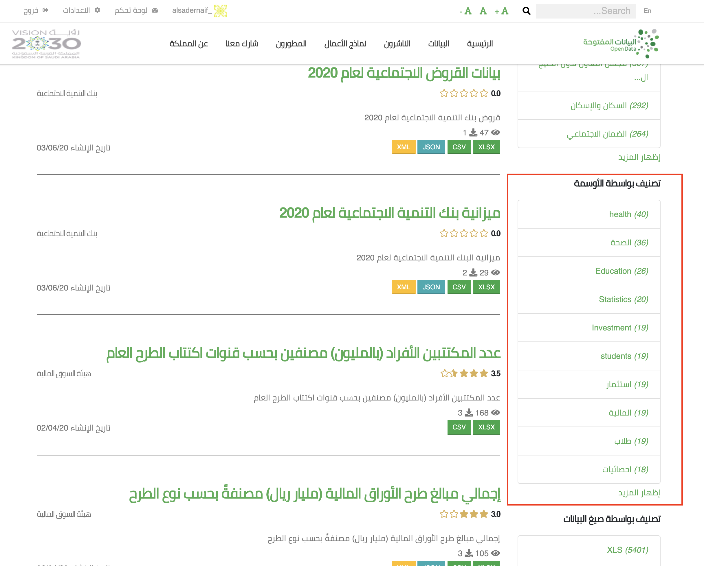
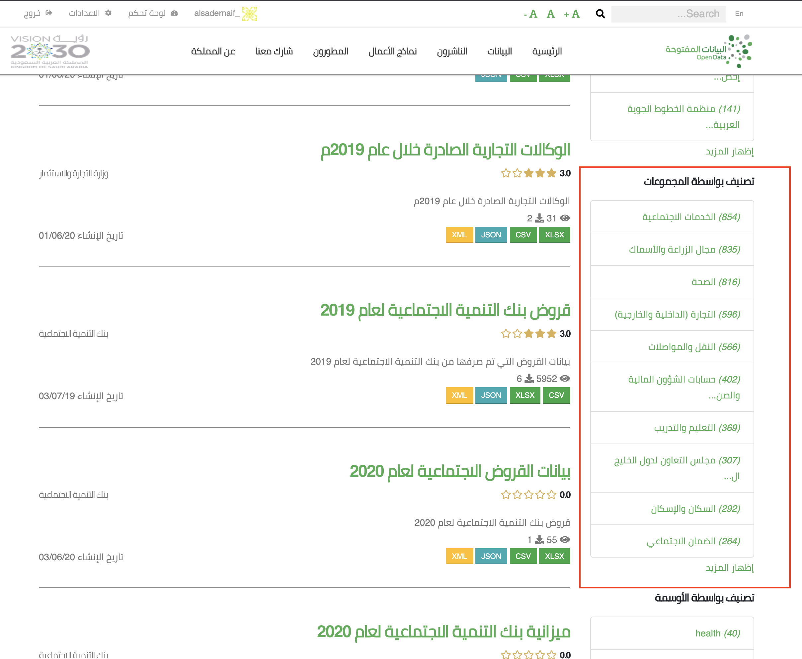

```{r setup, include=FALSE}
knitr::opts_chunk$set(echo = TRUE)
knitr::opts_chunk$set(fig.align = "center")
knitr::opts_chunk$set(message = F)
knitr::opts_chunk$set(warning = F)


library(tidyverse)
library(purrr)
library(rmarkdown)
```


الكود كامل هنا
[code](https://github.com/naif-alsader/my_blog/blob/master/_posts/2020-06-29-how-to-get-data-using-ckanr/how-to-get-data-using-ckanr.Rmd)


### مدخل

منصة البيانات المفتوحة السعودية توفر طريقتين للوصول للبيانات 

1- تحميل البيانات مباشرة من الموقع
https://data.gov.sa/ar

2- استخدام
API 
للتفاعل مع قواعد البيانات ثم تحميل البيانات مباشرة الى 
R


#### __مثال__

 لنقل انك تريد بيانات عن عدد  السجلات التجارية الصادرة عام ٢٠١٩

باستخدام الطريقة الاولى :

كل ماعليك هو الدخول الى موقع البيانات المفتوحة ثم كتابة "السجلات التجارية عام
2019"

```{r , echo = FALSE, out.width = "100%",  preview=TRUE}

```

هنا وجدنا ثلاث جداول للاعوام 
2019, 2018 
و
2017

سوف نختار *السجلات التجارية الصادرة خلال عام 2019م*


```{r , echo = FALSE, out.width = "80%"}

```

الان لاحظ بانة لدينا ثلاث صيغ لتحميل البيانات اختر اي صيغه تفضل ثم قم بتحميلها

"CSV" هي الصيغة المفضله دائما لاكن ليس مع البيانات المفتوحة السعودية
حيث انه لايوجد الا القليل جدا من البيانات بهذه الصيغه مقارنة ب 
"XLSX" و "XLX"


اما اذا اردت استخدام الطريقة الثانية
(API) :

فقط اكتب  هذا الرابط في المتصفح وسوف تحصل عليها مباشره

"https://data.gov.sa/Data/ar/api/3/action/datastore_search?resource_id=7a983d6d-842f-484e-bf14-49f3083c29df"

او

"https://data.gov.sa/Data/ar/dataset/eba6ecb0-9d38-4d9c-bc58-93f883690a2e/resource/7a983d6d-842f-484e-bf14-49f3083c29df/download/issued-cr-opendata-2019.xlsx"

لتنزيل البيانات وحفظها على جهازك


السر هنا يمكن في
__resource_id__
حيث ان لكل جدول بيانات رقم 
id
خاص فية بمجرد معرفتك لهاذا الرقم سوف تتمكن من تحميل البيانات التي تريد


### طريقة جلب البيانات الى R

لحسن الحظ لدينا مكتبة في 
R
تساعدنا في ايجاد 
__resource_id__
لاي بيانات نريدها مثلا اذا اردنا ايجاد 
ال
__resource_id__
لنفس البيانات السابقه نحتاج فقط لكتابة الكود التالي

```{r message=FALSE, warning=FALSE}
library(ckanr)


# البيانات التي نريد البحث عنها
q = "السجلات التجارية عام ٢٠١٩"


# تحتاج لاضافة موقع البيانات المفتوحة
ckanr_setup(url = "https://data.gov.sa/Data/ar/" )


#هنا نقوم بالبحث عن البيانات 
comm_reg_list<-package_search(q = q, as = "table", rows = 100)
```

عند استخدام 
`()package_search` 
فاننا نحصل على
*list* 

تحتوي على خمس اشياء

* الاول هو عدد البيانات التي وجدها البحث

`comm_reg_list$count`


```{r, echo=F}
comm_reg_list$count 
```


* الثاني هو طريقة فرز البيانات هل هو تصاعدي او تنازلي


`comm_reg_list$sort`


```{r, echo=F}
comm_reg_list$sort
```


* الثالث والخامس هما


`comm_reg_list$facets`

```{r, echo=F}
comm_reg_list$facets
```


`comm_reg_list$search_facets`

```{r, echo=F}
comm_reg_list$search_facets

```


* الرابع هو نتيجة البحث وهو عباره عن جدول يحتوي علي 42 عمود  وهو مايهمنا


`comm_reg_list$results`


```{r, echo=F}
comm_reg_list$results %>% as_tibble()  %>%  paged_table()

```


نتيجة البحث تعطينا معلومات عن النتائج التي وجدها البحث

مثلا

* عنوان الجدول

`comm_reg_list$results$ar_title`

```{r, echo=FALSE}
comm_reg_list$results$ar_title 

```


* تقييم الجدول

`comm_reg_list$results$rating`

```{r, echo=FALSE}
comm_reg_list$results$rating 
```


* اسم الناشر

`comm_reg_list$results$organization$title`

```{r, echo=FALSE}
comm_reg_list$results$organization$title 

```


* صيغ الحفظ لكل جدول بيانات

`comm_reg_list$results$resources %>% map("format")   `

```{r, echo=FALSE}

comm_reg_list$results$resources %>% map("format") 

```


* resource_id

`comm_reg_list$results$resources %>% map("id")  `

```{r, echo=FALSE}

map(comm_reg_list$results$resources, "id")

```


 سوف اترك الباقي لك لتكتشفة


الان من 
`comm_reg_list$results$ar_title`
يتضح لنا بان مانبحث عنة هو الصف رقم واحد


```{r, echo=FALSE}
comm_reg_list$results$ar_title 

```


الان سوف نقوم بجلب ال 
__resource_id__


```{r}
# resources_id
comm_reg_list$results$resources[[1]]$id
```

نلاحظ باننا حصلنا على ثلاث رموز مختلفة كل رمز منها يمثل صيغه مطابقة لما وجدناة في في الموقع

 من اجل الحصول على رؤية افضل ربما نحتاج لدمج عنوان جدول البيانات ورمز 
__resource_id__
و صيغة حفظ البيانات في جدول واحد


سوف نستخدم من  
`()tibble`
من مكتبة 
`dplyr`
و
`()map`
من مكتبة 
 `purrr`
 و
 `()unnest`
من مكتبة
`tidyr`

```{r message=FALSE, warning=FALSE, eval=F}

comm_reg_table<-tibble(title = comm_reg_list$results$ar_title,
       resources_id = comm_reg_list$results$resources %>% map("id"),
       format = comm_reg_list$results$resources %>%  map("format")) %>% 
  unnest() 

comm_reg_table

```

```{r, echo=F}
comm_reg_table %>% paged_table()
```


الان بعد ان قمنا بترتيب البيانات من الواضح بان اول صف هو مانبحث عنة اذا اردنا صيغة 
"XLSX"

سوف نقوم بجلب البيانات باستخدام 
`() ds_search`


```{r, eval=F}
data <- ds_search(comm_reg_table$resources_id[1], as = "table", limit  = 1000)

data$records 
```

```{r, echo=F}
readxl::read_xlsx("data/issued-cr-opendata-2019.xlsx") %>% head(1000) %>%  paged_table()
```


`()ds_search`
تساعدنا في ايجاد البيانات باستخدام
`resources_id`
 لاكن مشكلتها انها  لها 
 `limit`
 لعدد المشاهدات التي يمكن تحميلها. لذالك سوف نعمل 
 function
الهدف منها هو  تحميل رابط الملف 

تحتاج فقط لاضافة رابط التحميل

```{r}
comm_reg_table<-tibble(title = comm_reg_list$results$ar_title,
       resources_id = comm_reg_list$results$resources %>%  map( "id"),
       format = comm_reg_list$results$resources %>%  map("format"),
       url = comm_reg_list$results$resources %>%  map("url")) %>% 
  unnest() 

```

```{r, echo=F}
comm_reg_table %>% paged_table()

```


ثم استخدم الكود التالي

```{r, eval=F }

fetch_data <- function(url, xlsx = T, col_names = F, skip = 0, sheet = 1){
  
  # Temp file
  path <- tempfile(fileext = paste0(".xlsx"))
  download.file(url, path)
  
  #read data
  if (xlsx == T) {
      readxl::read_xlsx(path, col_names = col_names, sheet = sheet, skip  = skip)
  } else {
      readxl::read_xls(path, col_names = col_names, sheet = sheet, skip = skip)
  }
}

data <- fetch_data(comm_reg_table$url[1],col_names =  T)


```

```{r, echo=F}
readxl::read_xlsx("data/issued-cr-opendata-2019.xlsx") %>% paged_table()

fetch_data <- function(url, xlsx = T, col_names = F, skip = 0, sheet = 1){
  
  # Temp file
  path <- tempfile(fileext = paste0(".xlsx"))
  download.file(url, path)
  
  #read data
  if (xlsx == T) {
      readxl::read_xlsx(path, col_names = col_names, sheet = sheet, skip  = skip)
  } else {
      readxl::read_xls(path, col_names = col_names, sheet = sheet, skip = skip)
  }
}
```

لاحظ بانة لدينا 253 الف واكثر من عدد المشاهدات


هنا الكود كامل

```{r, eval=F}
q = "السجلات التجارية عام ٢٠١٩"

# تحتاج لاضافة موقع البيانات المفتوحة
# تحتاج فقط لادخالها مره واحدة
ckanr_setup(url = "https://data.gov.sa/Data/en/")


#هنا نقوم بالبحث عن البيانات 
comm_reg_list<-package_search(q = q, as = "table", rows = 100)

# مراجعة واختيار البيانات المرغوبة
comm_reg_table<-tibble(title = comm_reg_list$results$ar_title,
       resources_id = map(comm_reg_list$results$resources, "id"),
       format = map(comm_reg_list$results$resources, "format"),
       url = map(comm_reg_list$results$resources, "url")) %>% 
  unnest() 


# تحميل البيانات
data <- fetch_data(comm_reg_table$url[1],col_names = T )

```

كل ماتحاجة الان هو تغير 
`q`
ثم اختيار الجدول المناسب


ماسبق كان مدخل سريع الى تحميل البيانات وربما في اكثر الاحيان الطريقة السابقه سوف تكون كافية لجلب البيانات التي تريد

الان لنستكشف مايمكننا عملة باستخدام الاوامر الاخرى من مكتبة
`ckanr`

### ماهي `ckanr` وكيف يمكننا استعمالها بالطريقة المثلى

اولا موقع البيانات المفتوحة السعودية يستخدم
tool 
اسمها
[*CKAN*](https://docs.ckan.org/en/latest/user-guide.html) 
وهي اختصار   الي
(The Comprehensive Knowledge Archive Network)


تستخدم هذة الاداة من قبل اكثر من 
125
منظمة او جهة حكومية من اجل تصميم مواقع البيانات المفتوحة

منها

*  "http://data.glasgow.gov.uk"             
*  "http://data.go.id"                      
*  "http://data.gov.au"                     
*  "http://data.gov.hr"                     
*  "http://data.gov.ie"                     
*  "http://data.gov.ro"                     
*  "http://data.gov.sk"                     
*  "http://data.gov.uk"                     
*  "http://data.grcity.us"                  
*  "http://data.kk.dk"                      
*  "http://data.lexingtonky.gov"            
*  "http://data.london.gov.uk"

اذا اردت الوصول الى بيانات اي من هذة المواقع كل ماعليك هو استبدال

`ckanr_setup(url = "https://data.gov.sa/Data/en/")`

مع اي من الروابط السابقة، قد يكون هذا جيد في حالة المقارنة بين الدول اذا توفرت البيانات المناسبة، مثلا

`ckanr_setup(url = "http://data.gov.uk")`


اكتب الكود التالي لروئية 125 
server
مسجل
 
```{r, eval=F}
ckanr::servers()
```


اما 
[`ckanr`](https://github.com/ropensci/ckanr)
فهي 
R Client for the CKAN API

باختصار هي تساعدنا على التحكم الكامل بكل خصائص 
CKAN


### طرق البحث عن البيانات

الان هناك اكثر من طريقة للبحث عن البيانات

### عن طريق اسم الجهة المقدمة للبيانات (الناشر)  (organization)

يمكننا رؤيهة الناشرين من خلال الموقع


```{r , echo = FALSE, out.width = "80%"}

```

لاحظ ان عدد الناشرين هو 
116
وانه يمكننا ايضا معرفة عدد البيانات لكل ناشر

سوف نختار المديرية العامة للجوازات


يمكننا عرض جميع الجهات باستخدام 
`()organization_list`

```{r, eval=F}
organization_list(limit = 10000, as = "table") 
```

```{r, echo=F}
organization_list(limit = 10000, as = "table") %>%
  paged_table()
```

الان حصلنا على جدول يحتوي على 18 عمود مايهمنا فيه هو عمودين فقط


`name`: اسم الناشر الذي سوف نستخدمة للبحث


`package_count`: عدد جداول البيانات


وربما تحتاج 


`ar_title`: اسم الناشر باللغة العربية


لاحظ في الكود التالي اننا اضفنا
`:organization`
قبل اسم الناشر


```{r}
q = "organization:general_directorate_of_passport"

passports_package<-package_search(q = q, as = "table", rows = 1000)

passports_table<-tibble(title = passports_package$results$ar_title,
       resources_id = map(passports_package$results$resources, "id"),
       format = map(passports_package$results$resources, "format"),
       url = map(passports_package$results$resources, "url")) %>% 
  unnest() 

```

```{r, echo=F}
passports_table %>% paged_table()

```


```{r}
# سوف اقوم باستخراج التاريخ الموجود في العنوان 
# وإضافته حتى نحصل على جدول اكثر تنظيما
# وإضافه 480  الي التاريخ الهجري من اجل التقريب الى التاريخ الميلادي
# قد يكون هناك سنه خطاء

passports_table<-tibble(title = passports_package$results$ar_title,
                        year = str_extract_all(title, "(\\d\\d\\d\\d)"),
                        resources_id = map(passports_package$results$resources, "id"),
                        format = map(passports_package$results$resources, "format"),
                         url = map(passports_package$results$resources, "url")) %>% 
  unnest() %>% 
  type_convert() %>% 
  mutate(year = if_else(str_detect(year, "(14\\d\\d)"), year + 580, year)) %>% 
  arrange(desc(year))

```

```{r, echo=F}

passports_table %>% paged_table()

```

مع الاسف يبدو بان البيانات لم يتم تحديثهااو ربما لم تذكر في العنوان


الان كل ماعليك فعله هو اختيار ال
`url`
المناسب ثم استخدام الامر
`()fetch-data`

```{r}
data <- fetch_data(passports_table$url[1], xlsx = F, skip = 6, col_names = T)
```

```{r, echo = F}
data %>% paged_table()
```


### عن طريق الاستعلام (query)

وهو المثال الي شرحناه سابقا


```{r, eval=F}
q = "السجلات التجارية عام ٢٠١٩"

#هنا نقوم بالبحث عن البيانات 
comm_reg_list<-package_search(q = q, as = "table", rows = 100)

# مراجعة واختيار البيانات المرغوبة
comm_reg_table<-tibble(title = comm_reg_list$results$ar_title,
       resources_id = map(comm_reg_list$results$resources, "id"),
       format = map(comm_reg_list$results$resources, "format"),
       url = map(comm_reg_list$results$resources, "url")) %>% 
  unnest() 

comm_reg_table %>% paged_table()

# تحميل البيانات
data <- fetch_data(comm_reg_table$url[1], col_names = T)

```


### عن طريق وسم (tag)

الوسوم تظهر بهذا الشكل في الموقع


```{r, echo=F, out.width="80%"}

```


يمكننا عرض جميع الوسوم باستخدام 
`()tag_list`


```{r, eval=F}
tag_list(as = "table") 
```

```{r, echo=F}
tag_list(as = "table") %>% paged_table()
```


الان نستطع البحث باستخدام الوسم 


لنجرب مثلا الوسم 
`استثمار`


لاحظ اننا استخدما 
`fq` 
بدلا عن
`q`

```{r}
tags = "tags:استثمار" 

#هنا نقوم بالبحث عن البيانات 
inve_reg_list<-package_search(fq = tags , as = "table" , rows = 100)


# مراجعة واختيار البيانات المرغوبة
inve_reg_table<-tibble(title = inve_reg_list$results$ar_title,
       resources_id = map(inve_reg_list$results$resources, "id"),
       format = map(inve_reg_list$results$resources, "format"),
       url = map(inve_reg_list$results$resources, "url")) %>% 
  unnest()
```


```{r, echo=F}
inve_reg_table  %>% paged_table()
```


```{r}
data <- fetch_data(inve_reg_table$url[1], skip =9, col_names = T)
```


```{r, echo=F}
data %>% paged_table()

```


### عن طريق مجموعة بيانات  (group)

المجموعات تظهر بهذا الشكل على صفحة البيانات المفتوحة


```{r, echo=F, out.width= "80%"}



```


ويمكنك ايجاد جميع المجموعات باستخدام الامر
`()group_list`

```{r}
group_list(limit = 10000, as = "table") 

```


ويمكننا البحث باستخدام المجموعة بهذه الطريقة


```{r}
groups = "groups:population_and_housing"

#هنا نقوم بالبحث عن البيانات 
inve_reg_list<-package_search(fq = groups , as = "table" , rows = 100)


# مراجعة واختيار البيانات المرغوبة
inve_reg_table<-tibble(title = inve_reg_list$results$ar_title,
       resources_id = map(inve_reg_list$results$resources, "id"),
       format = map(inve_reg_list$results$resources, "format"),
       url = map(inve_reg_list$results$resources, "url")) %>% 
  unnest()
```


```{r, echo=F}
inve_reg_table  %>% paged_table()
```


```{r}
data <- fetch_data(inve_reg_table$url[1], skip =0, col_names = T)
```


```{r, echo=F}
data %>%
  fill(
       
    `المنطقة` 
    
    )  %>% paged_table()

```


### الفرق بين package و resource

*Package*: 
هي البيانات التي تبحث عنها


*Resource*:
هي هي صيغ التي تتوفر فيها البيانات


بمعني ان 
package 
قد يحمل اكثر من 
resource


احيانا قد يكون 
package
عباره عن بيانات تقيس نفس المؤشر عبر عده سنين
مثال:
قد يكون
package
هو عدد السجلات التجارية
و
resource
يحمل عده ملفات كل ملف منها يمثل سنة
او قد تكون الملفات تمثل صيغ مختلفة لنفس السنة


## المصادر {.appendix}

* https://github.com/ropensci/ckanr

* https://docs.ckan.org/en/2.8/api/

* https://data.gov.sa/ar/home
