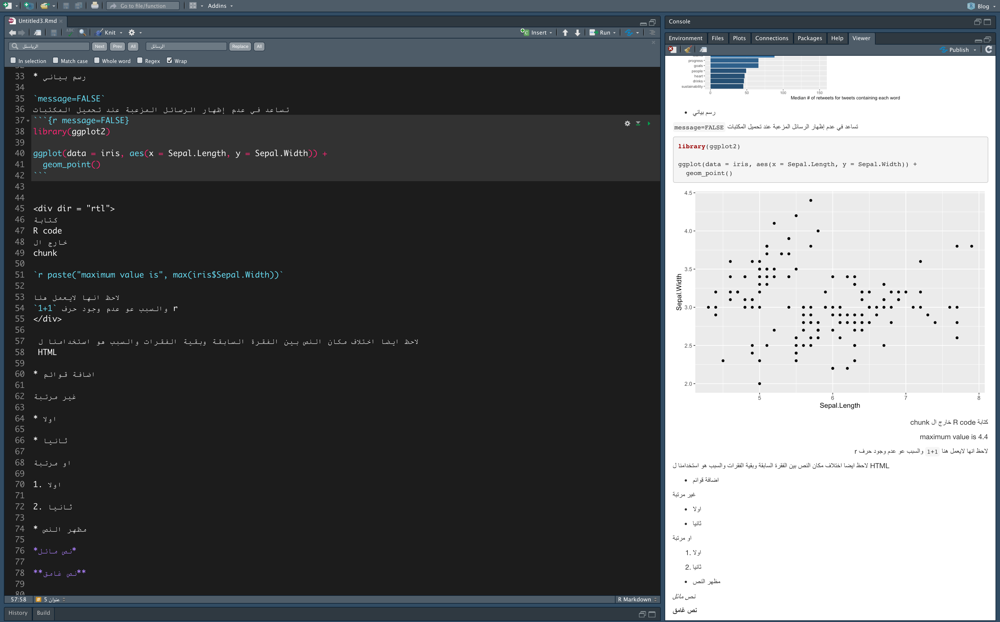
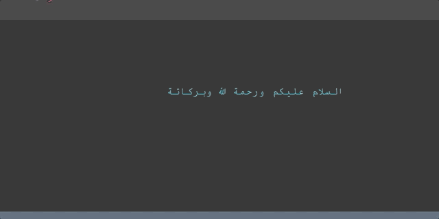
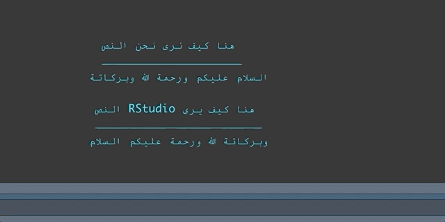

```{r setup, include=FALSE}
knitr::opts_chunk$set(echo = FALSE)
```


في هذا المنشور
[هنا](https://www.naif-alsader.com/posts/2020-08-10-what-is-rmarkdown/)
كتبت عن 
R Markdwon
بشكل مبسط لذالك إذا كنت لاتحمل اي فكرة عن 
R markdwon 
انصحك بقرائتة اما في هذا المنشور فسوف اكتب عن مشاكل الكتابة باللغة العربية في Rstudio وطرق تنسيق النص العربي في 
R Markdown.

الحلول الموجودة هنا نتيجة تجربة شخصية لذالك قد يكون هناك حلول افضل لاكن هذة الحلول كانت كفيلة بتحسين تجربتي.


في البداية سوف اعرض صورتين لتوضيح 
بعض خصائص 
R Markdown

ربما تحتاج الى تقريب الصورة

```{r, layout="l-page"}
library(knitr)

include_graphics("img/rmarkdown_prop1.png")
```

```{r, layout="l-page"}

```


من الصور السابقة نلاحظ بإن دعم اللغة العربية ليس جيدا وذالك لعدة اسباب
سوف احاول ان اسردها هنا وايضا بعض الحلول لها.


## مشاكل الكتابة باللغة العربية 

تنقسم المشاكل الى قسمين:

* الكتابة في Rstudio IDE.

* طريقة عرض التقرير النهائي (Rmarkdown).

سوف نستعرض اولا المشكلة الاولى

### الكتابة في Rstudio IDE

تنقسم هذة المشكلة الى ثلاثة فروع

1. إختلاف موضع المؤشر أثناء الكتابة


شاهد معي ال
gif
التالي

```{r, layout="l-page"}

include_graphics("img/cruosr-writting.gif")


```

لاحظ بأن المؤشر لايستجيب بالشكل المطلوب

*"جرب اكتب نص عربي في المتصفح او المذكرة وقارن كيف يستجيب المؤشر"*


قد لاتعتبر هذة مشكلة بحد ذاتها لاكن تأثيرها يظهر عندما نحاول تحديد كلمة للتعديل عليها او حذفها
وهي المشكلة الثانية


2. إختلاف المؤشر أثناء التحديد


شاهد محاولتي لإزالة كلمة السلام
وكيف اني قمت بحذف جميع الكلمات باستثنائها

```{r, layout="l-page"}



```


السبب هو أن محرر 
Rstudio
لايدعم الانتقال التلقائي للكتابة من اليمين لليسار حيث انة فقط يدعم الكتابة من اليسار لليمين


الصورة التالية توضح كيف يرى
Rstudio
النص

```{r, layout="l-page"}

include_graphics("img/how-r-sees-arabic.png")

```


بمعنى انة رغم تحديدي لكلمة السلام فإن 
Rstudio
يرى بأني قمت بتحديد كلمة وبركاتة


للتوضيح أكثر

المحرر يضع لكل كلمة رقم 

مثلا 
`السلام`
لانها أول كلمة
تحصل على الرقم 1

ثم
`عليكم`
تحصل على الرقم 2

```{r, warning=FALSE, message=FALSE}

library(tidyverse)
words <- c("السلام",
           "عليكم",
           "ورحمة",
           "الله",
            "وبركاتة") %>% rev.default()

index <- seq(5, 1, -1) 

tibble::tibble(words, index) %>% pivot_wider(names_from = words, values_from = index) %>% pander::pander()

```


اذا كان المحرر يدعم الإنتقال التلقائي للكتابة فسوف تتحول رؤيتة للنص للشكل التالي


```{r, warning=FALSE, message=FALSE}

words <- c("السلام",
           "عليكم",
           "ورحمة",
           "الله",
            "وبركاتة")

index <- seq_len(5) 

tibble::tibble(words, index) %>% pivot_wider(names_from = words, values_from = index) %>% pander::pander()

```


* هناك اكثر من حل


1- أن ناخذ Rstudio على قد عقلة

وهو ان تجاهل الكلمة ونتعامل بالارقام

مثلا اذا اردنا حذف كلمة السلام فإنا نقوم بحذف اول كلمة من جهة اليسار
وهي وبركاتة

```{r, layout="l-page"}

```

بصراحة هذا الاسلوب غير مجدي ومتعب خصوصا إذا كان النص طويل واردت حذف كلمة في المنتصف

الطريقة الثانية هي

2- استخدام Find > Replace

اولا 
من اجل إظهار خاصية 
Find & Replace


إذا كنت تستخدم 
**Mac**
اضغط 

`command + F`

أما إذا كنت تستخدم 
**windows**
اضغط 

`ctrl + F`

الان فقط كم بكتابة الكلمة التي تريد التعديل عليها في خانة
**Find**
والتعديل في خانة
**Replace**
 
 
```{r, layout="l-page"}
include_graphics("img/find-replace.gif")
```


3- الكتابة في Text Editor ثم لصقها في Rstudio


 
```{r , layout="l-page"}

include_graphics("img/with-texteditor-.gif")

```


ربما تعتبر هذة الطريقة الأسهل والاكثر فعالية


إذا اردت رأي الشخصي فأنا افضل الكتابة المباشرة في
Rstudio
وفي حالة رغبتي في التعديل أقوم بالتعديل مباشرة إذا امكنني حساب عدد الكلمات او استخدام خاصية
Find & Place


5- استخدام محررات اكواد اخرى

Rstudio 
هو افضل 
IDE 
لاستخدام 
R 
بلا منازع

لذالك عند انتقالك الى محرر آخر فإنك سوف تضحي ببعض  المميزات التي يقدمها
Rstudio

لاكنك بالمقابل سوف تحصل على ميزات جديدة ربما انت في حاجتها

هناك العديد من المحررات التي يمكن استخدامها.  على سبيل المثال، انا قمت بتجربة 
[Visula studio Code](https://docs.microsoft.com/en-us/visualstudio/rtvs/rmarkdown-with-r-in-visual-studio?view=vs-2017)
في البداية لم اكن مرتاح لاستخدامة ، ربما بسبب تعودي على استخدام 
Rstudio
لاكن التجربة لم تكن سيئة 

[هنا](https://renkun.me/2019/12/11/writing-r-in-vscode-a-fresh-start/)
تجد منشور عن كيفية اساتخدام 
Visual Studio Code
مع
R

ربما تحتاج ايضا الى تحميل 
[pandoc](https://pandoc.org/installing.html)

إن شاء الله سوف احاول الكتابة عن تجربتي مع 
Visual Studio Code 
في اقرب وقت.


3.  دمج النص العربي مع الإنجليزي


لاحظنا في السابق أن محرر
Rstudio 
لايتعامل بشكل مع النص اذا كان يكتب من اليمين الى اليسار
لاكن ماذا سوف يحدث اذا دمجنا نصين مختلفين
واحد باللغة العربية والآخر بالإنجليزية

```{r , layout="l-page"}

```

المشكلة هنا هو انة ،مثل ماذكرنا سابقا، تكمن  تعامل 
المحرر من النص العربي
لذالك نرى هذا التصرف الغريب


* الحل

1. 
الحل لهذة المشكلة هو بكتابة النص العربي في سطر والنص الإنجليزي في سطر آخر
او أن تستخم 
Text Editor


للاسف يبدو بأن هذة المشكلة لن تحل في الوقت القريب من قبل
Rstudio
حيث انها مازالت  مفتوحة في
حساب 
Rstudio
على
Github
انظر المشكلة 
[هنا](https://github.com/rstudio/rstudio/issues/3808)


### المشكلة مع  شكل المستند النهائي 


كما لاحظنا في هذة الصورة 
بإن النص العربي يبداء  من اليسار الى اليمين

```{r , layout="l-page"}

```


والذي كان يجب ان يظهر بهذا الشكل

```{r , layout="l-page"}
include_graphics("img/rmarkdown_prop2_rtl.png")
```


* الحل

حل هذة المشكلة هو بإضافة  
**css code**

حمل ملف ال 
css 
من
[هنا](https://drive.google.com/file/d/1c8u0ioDFSjjunxNWLihVdjbhUuEbMEAx/view?usp=sharing)

ثم قم بإضافتة الى البيانات الوصفية. تاكد بأن يكون الملف في نفس المجلد مع المستند


````md
---
title: "untitled"
author: "Naif"
output:
  html_document:
    css: "rtl_botstrap.css"
---
````

> تم جمع هذا الملف من صفحة morteza/bootstrap-rtl على Github مع إضافة سطرين للتحكم بالكود


