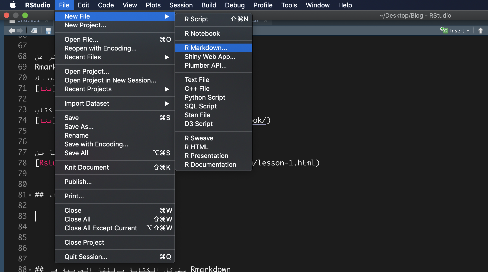
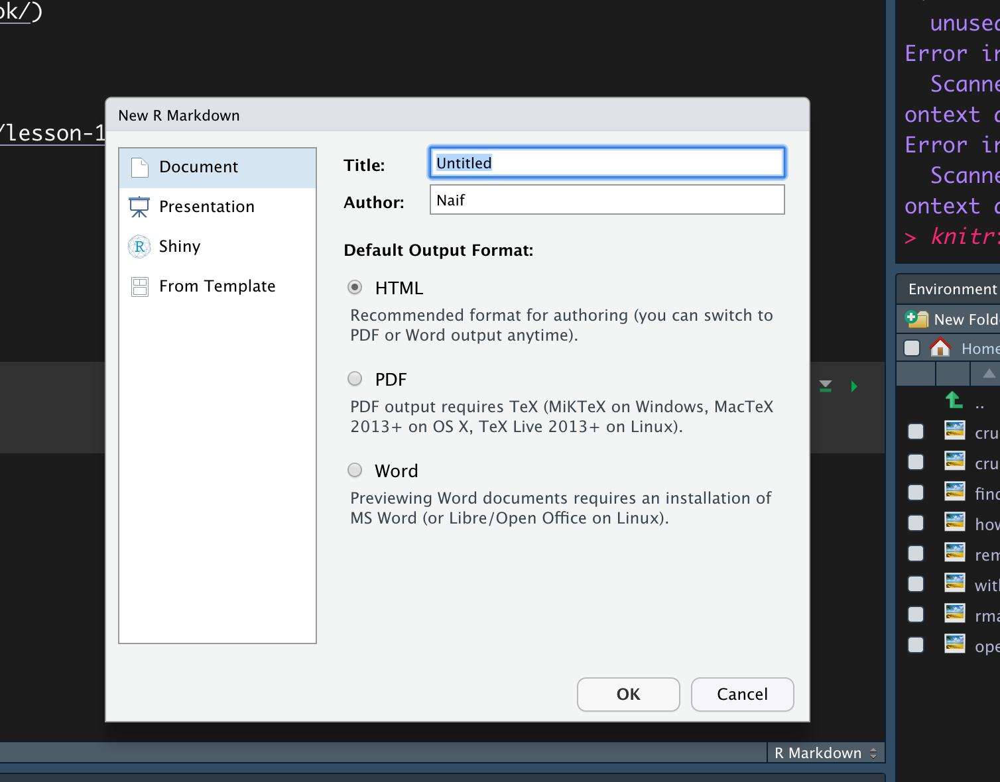
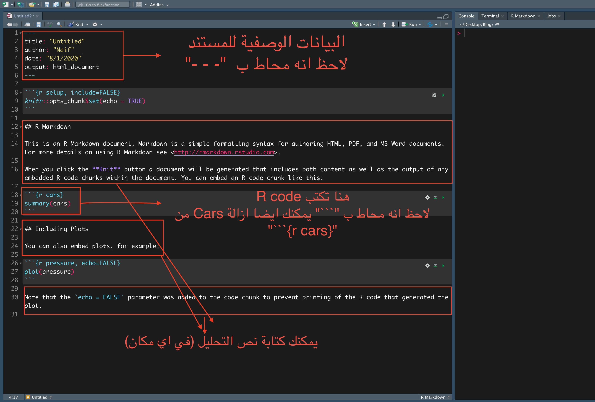
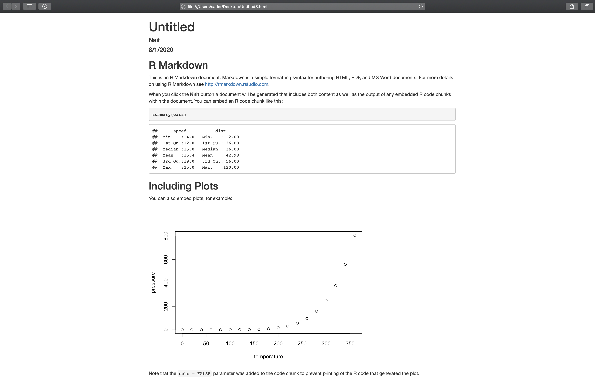
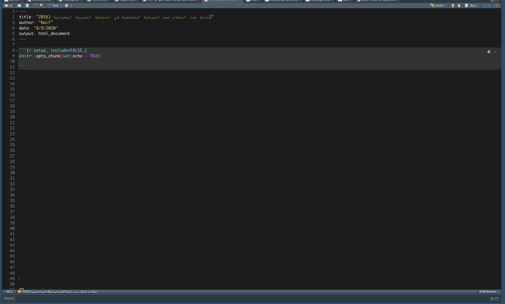
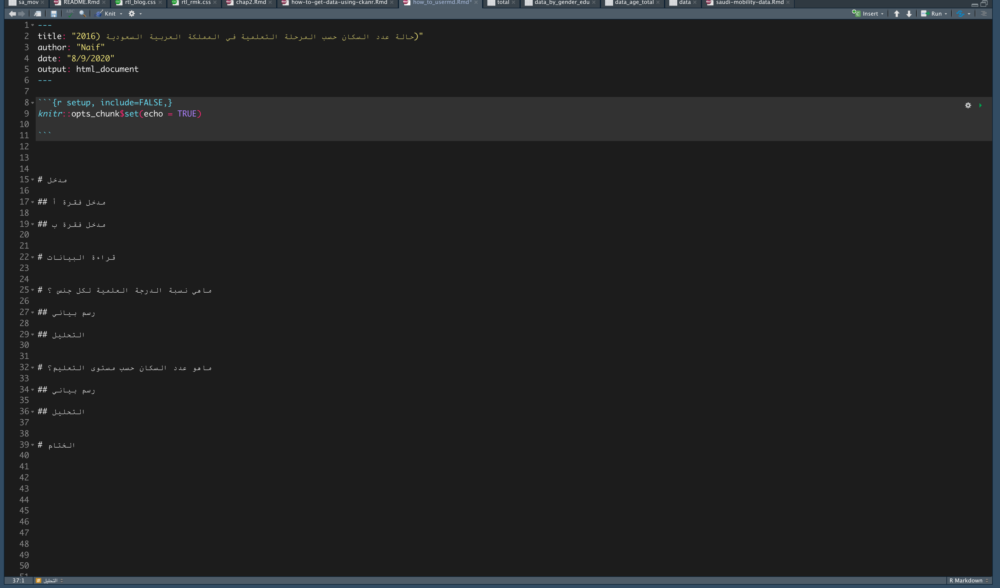
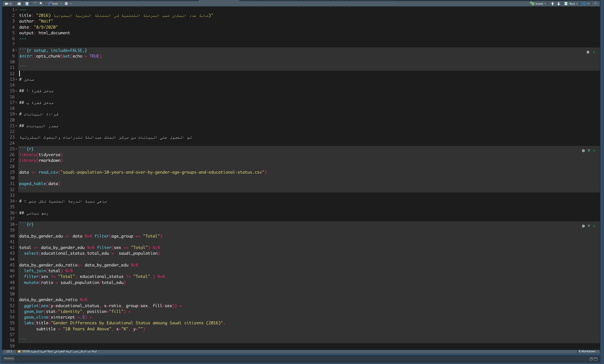
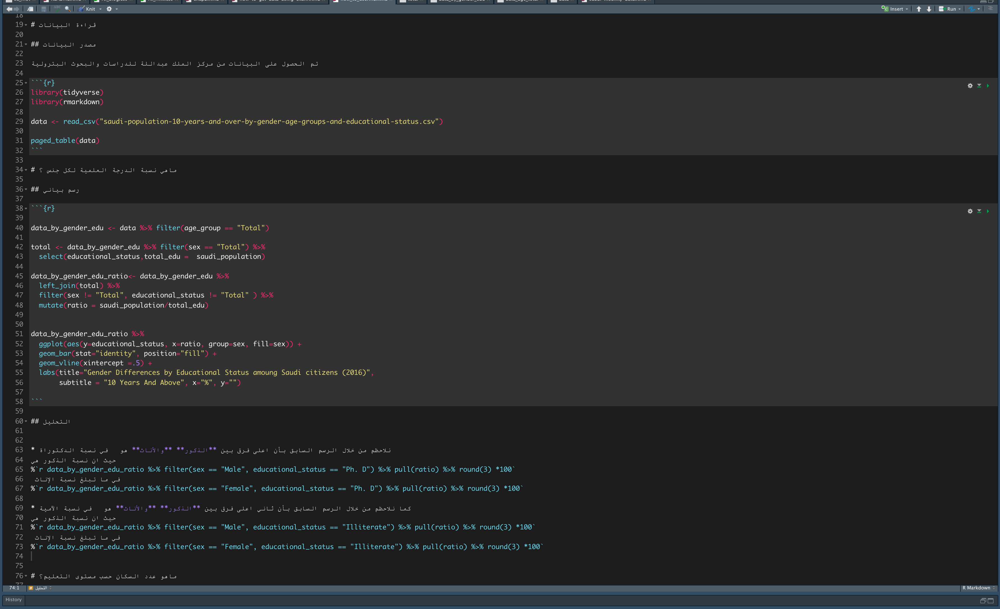
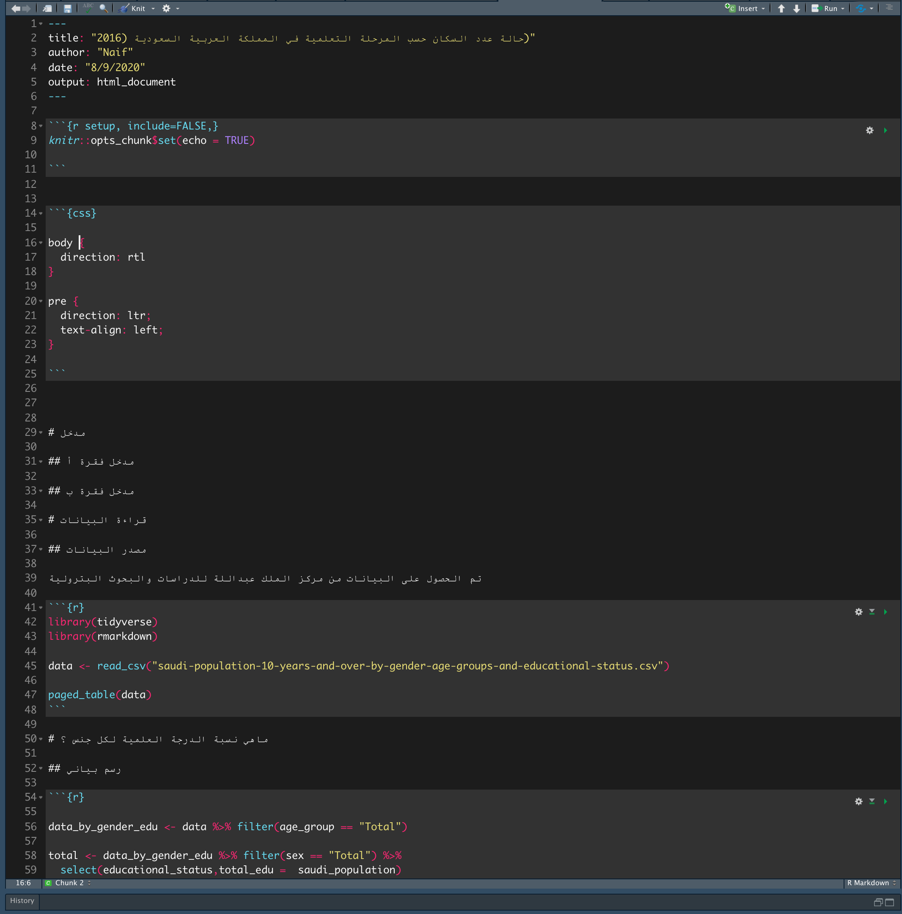
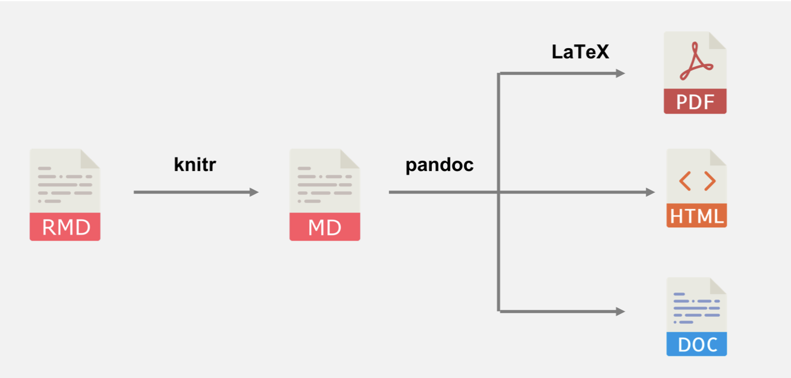

```{r setup, include=FALSE}
knitr::opts_chunk$set(echo = FALSE)
```


## ماهو R Markdown

R Markdown
هي صيغة ملف تساعدنا على دمج تحليل البيانات مع الكود المستخدم لعمل التحليل في ملف واحد.

مثلا، بدل ان تفتح ملف في 
Microsoft Word  
وتكتب التحليل ثم تقوم بنسخ الرسوم البيانية او أداء نموذج معين من
R,
الى
Word,
يمكنك كتابتها باستخدام 
Rmarkdown
واختصار الوقت.


هناك الكثير من المهمات التي يمكن عملها بإستخادم 
Rmarkdown

مثل:

* تصدير التحليل الى اكثر من صيغة (PDF,HTML,Word,PowerPoint, etc).

* بناء لوحة بيانات تفاعلية.

* إنشاء عروض بيانية.

* نشر كتاب.

* إنشاء مواقع او مدونات.

وغيرها الكثير, وذالك فقط بإستخدام R code.

تجد
[هنا.](https://rmarkdown.rstudio.com/gallery.html)
مكتبة لبعض الاشياء التي يمكن عملها مع 
R Markdown

او إذا اردت القراءة اكثر عن 
Rmarkdown
اذن هذا الكتاب سوف يكون الانسب لك
[هنا.](https://bookdown.org/yihui/rmarkdown/)

او هذا الكتاب بإسلوب CookBook
[هنا.](https://bookdown.org/yihui/rmarkdown-cookbook/)


اما إذا كنت تفضل المشاهدة على القراءة هذه السلسلة تعتبر مدخل جيد وهي مقدمة من 
[Rstudio Education.](https://rmarkdown.rstudio.com/lesson-1.html)

## كيف تبداء؟

اولا يجب ان تكون تعمل على 
Rstudio

1- اختر File < New file < R Markdown

```{r, layout="l-page"}
library(knitr)

```

2- قم بإدخال البيانات الوصفية.

* Title


* Author

* Default Output Format

الافضل دائماً أختيار صيغة 
HTML
لانه يسهل التحكم بها وتوفر خصائص متعددة.

```{r, layout="l-page"}

```


3- محتويات ملف rmd (صيغة ملف R Markdown).

الان بعد ان تضغط 
OK،
سوف يتم إنشاء ملف بصيغة
`.rmd`

يحتوي علي التالي:


```{r, layout="l-page"}

```


4- شكل المستند النهائي 

الان من اجل تصدير المستند اضغط 


**command + shift + k ** 
إذا كنت تستخدم
Mac 

او

**ctrl + shift + K** 
إذا كنت تستخدم
Windows


```{r , layout="l-page"}

```


لاحظ بأن المستند النهائى بصيغة
*HTML*
هذا يعطينا الإمكانية للتحكم الكامل بشكل المستند النهائي بإستخدام
CSS (لغه تستخدم للتحكم بمظهر مواقع وصفحات الإنترنت)


لاحظنا من الصور السابقة بإن ملف ال 
R Markdown
ينقسم الى ثلاث اقسام:

1. البيانات الوصيفة وهي محاطة بثلاث شرطات `---`  ويطلق علية **YAML header**
2. المكان الذي يكتب فية الكود وهو محاط بثلاث  ```` ``` ````، ويطلق علية **Code Chunks**
3. المكان الذي يكتب في النص او التعليق على الكود وهو غير محاط بأي شيء


## تجربة عملية

الان سوف نقوم بعمل تحليل سريع بعنوان


"حالة عدد السكان حسب المرحلة التعلمية في المملكة العربية السعودية (2016)"

اولا قم بتحميل البيانات من 
[هنا](https://datasource.kapsarc.org/explore/dataset/saudi-population-10-years-and-over-by-gender-age-groups-and-educational-status/table/?disjunctive.sex&disjunctive.age_group&disjunctive.educational_status&sort=time_period)

ثم إتبع الخطوات السابقة واكتب في ال


`title`: حالة عدد السكان حسب المرحلة التعلمية في المملكة العربية السعودية (2016)


`author`: *اكتب اسمك*


ثم
قم بمسح جميع ماتحت

````md
```{r setup, include=FALSE} `r ''`


knitr::opts_chunk$set(echo = TRUE)
  
```

`````


ليصبح شكل المستند بهذا الشكل

```{r, layout="l-page"}

```


الان سوف اقوم بإضافة النقاط الأساسية

```{r, layout="l-page"}

```

لاحظ هنا بأن علامة 
`#`
هي التي تستخدم للتحكم في ترتيب هيكل المستند


الان سوف اقوم بإضافة الكود بإستخادم 

**option+shift+I**

او

**ctrl+alt+I**

او

**knit** من اعلى المستند


```{r, layout="l-page"}

```

<div style = "background-color:#455a64; color:white;
    border-radius: 10px;">
<p style = "margin-right: 1em">
ملاحظة: يمكننا الكتابة بأكثر من لغة
وهي
awk, bash, coffee, gawk, groovy, haskell, lein, mysql, node, octave, perl, psql, Rscript, ruby, sas, scala, sed, sh, stata, zsh, highlight, Rcpp, tikz, dot, c, fortran, fortran95, asy, cat, asis, stan, block, block2, js, css, sql, go, python, julia, sass and scss
</p>
</div>

<br>

لاحظنا في الطريقة السابقة انها يمكننا إضافة الكود، لاكنة يكون معزول عن النص هذا يعتبر جيد لاكن في بعض الحالات قد تحتاج ان تكتب الكود مع النص.

مثلا لنقل انك تريد أن تضيف تاريخ اليوم وتريد لهذا التاريخ ان يكون حديث في كل مره تقوم بتصدير المستند.

في الواقع يمكنك ذالك بإضافة


````md


` r ثم تكتب الكود هنا` 


`````


مثلا 
تاريخ اليوم هو ``` ` ()r Sys.Date` ```

وتظهر بهذا الشكل

*تاريخ اليوم هو `r Sys.Date()`*


لاحظ الصورة التالية

```{r, layout="l-page"}


```

استخدمت هنا الكود بجوار النص 
(في فقرة التحليل)
من اجل جلب نسبة الذكور والإناث وذالك بدل من كتابتهم يدويا.

  الفائدة من هذه الطريقة هي لكتابة التقارير الدورية بحيث انة بدل من كتابة التقرير في كل سنة يمكننا فقط تحديث البيانات ومعها يتحدث التقرير تلقائيا


لاحظ ايضا إستخدامي لعلامة النجمة حول كلمتي الذكور و الإناث هو فقط لتغميق الخط

مثل الفرق بين 


الذكور
و
**الذكور**

كما ان إستخدام علامة النجمة لمرة واحدة يفيد في إضافة القوائم

مثلا

واحد إثنين  ثلاثة


* واحد
* إثنين
* ثلاثة
 


الان سوف نقوم بتصدير التقرير الى صيغة 
HTML
وذالك بإحدى طريقتين

* **command + shift + k ** او **ctrl + shift + k ** 

* **الضغط على `knit` في أعلى المستند**


لاكن قبل القيام بذالك سوف نقوم بإضافة 
css code
في بداية الصفحة 
(بعد البيانات الوصفية)
لتحسين الدعم للغة العربية

(راجع هذا [المنشور](https://www.naif-alsader.com/posts/2020-08-10-how-to-write-arabic-text-in-rmarkdown/) الذي شرحت فية طريقة الكتابة باللغة العربية في Rstudio و  R Markdown)

````md

```{css} `r ''`

body {
  direction: rtl
}

pre {
  direction: ltr;
  text-align: left;
}

```

````


```{r, layout="l-page"}

```


هذا هو شكل التقرير النهائي


```{r, layout="l-page"}
include_graphics("img/deoc_before_apperance.gif")

```


### التعديل على مظهر التقرير

هناك شيئين يمكن التحكم بهم وهما


* البيانات الوصفية (YAML headr).

* Knitr Options (Code Chunks). 


#### knitr options

بإستخدام 
`knitr` 
تستطيع التحكم بالكود المستخدم 

مثلا 

* إذا اردت إزالة الرسائل المزعجة عند تحميل المكتبات

قم بإضافة 
`message = FALSE`
و
`warning = FALSE`


الى بداية ال
Code Chunk،
بعد حرف ال
`r`
ويفصل بين الجميع علامة
`,`


````md

```{r, message = FALSE, warning = FALSE} `r ''`

library(tidyverse)
library(rmarkdown)

data <- read_csv("saudi-population-10-years-and-over-by-gender-age-groups-and-educational-status.csv")

paged_table(data)

```
````


* إظهار او إخفاء الكود


قم بإضافة 

`echo = TRUE`
اذا اردت إظهار الكود او


`FALSE` 
إذا اردت إخفاءة


````md

```{r, echo = FALSE} `r ''`


library(tidyverse)
library(rmarkdown)

data <- read_csv("saudi-population-10-years-and-over-by-gender-age-groups-and-educational-status.csv")

paged_table(data)

```
````


وغيرها الكثير تجدها 
[هنا](https://yihui.org/knitr/options/)


#### البيانات الوصفية (YAML header)

البيانات الوصفية تساعدنا عى التحكم بمظهر النص

وابسط صورة لها تكون بهذا الشكل 


````md
---
title: "حالة عدد السكان حسب المرحلة التعلمية في المملكة العربية السعودية (2016)"
author: "Naif"
date: "8/9/2020"
output: html_document:

---   

````

لاكن


* مثلا إذا اردنا إضافة الفهرس


````md
---
title: "حالة عدد السكان حسب المرحلة التعلمية في المملكة العربية السعودية (2016)"
author: "Naif"
date: "8/9/2020"
output:
  html_document:
    toc: true
    toc_depth: 2
---   

````

* إضافة ثيم


````md
---
title: "حالة عدد السكان حسب المرحلة التعلمية في المملكة العربية السعودية (2016)"
author: "Naif"
date: "8/9/2020"
output:
  html_document:
    toc: true
    toc_depth: 2
    theme: darkly
    highlight: tango

---   

````

لاحظ هنا إضافتي لجزئيتين وهما

`theme`: وهي تتحكم بشكل المستند 
`highlight`: وهي تتحكم بشكل الكود


جرب قيم اخرى

**theme**: cerulean, journal, flatly, darkly, readable, spacelab, united, cosmo, lumen, paper, sandstone, simplexand yeti

**highlight**: espresso, tango, pygments, kate, monochrome, zenburn, haddock and textmate


* إضافة خيار إخفاء او إظهار الكود


```md
---
title: "حالة عدد السكان حسب المرحلة التعلمية في المملكة العربية السعودية (2016)"
author: "Naif"
date: "8/9/2020"
output:
  html_document:
    toc: true
    toc_depth: 2
    theme: darkly
    highlight: tango
    code_folding: hide
---   

```

وغيرها الكثير تجدها في المصادر المذكورة بالأعلي


هنا الشكل النهائي للمستند

```{r}
include_graphics("img/final_document.gif")
```

يمكنك تحميل الملف من 
[هنا](https://drive.google.com/file/d/176LbdCQ3DSggcDgWf6dFPpbh_yBdsu1m/view?usp=sharing)

## كيف يتم تحويل R Markdown الى HTML او غيرها.

لاحظ معي المخطط التالي

```{r, fig.cap="source:https://bookdown.org/yihui/rmarkdown-cookbook", preview=TRUE}

```


* RMD: هو ملف R Markdown

* [knitr](https://yihui.org/knitr/) : هي مكتبة تقوم بتحويل ملف R Markdown الى Markdown

* [pandoc](https://pandoc.org/) : هي اداه تستخدم للتحويل بين لغات markup (md, html,doc,pdf) ودورها هنا هو التحويل من markdown الى HTML او DOC او pdf


